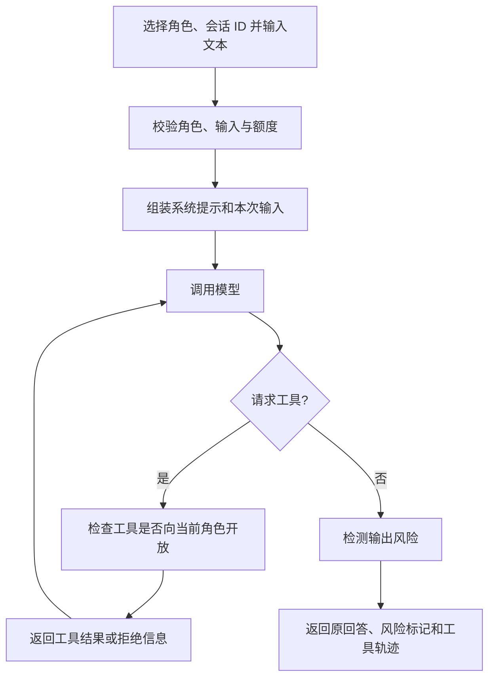

# ChemAI · 当前原型流程

本页描述当前代码行为。OCR、完整教学闭环与生产权限属于规划，历史设计见[附录](../附录/README.md)。

## 一次对话

工具循环有轮数上限，达到上限后要求模型输出最终回答。风险检测不阻断原回答。

## 工具与数据

- `kb_search`：本地关键词检索，不是向量检索。
- `student_profile`：示例学生档案，不是实际学生记录。
- `class_overview`：仅教师角色可调用，返回示例班级信息。
- `request_more_info`：记录信息缺口并返回提示，不会自动联系用户。

模型上下文包含系统提示、同一会话和角色最近最多 8 条用户/助手消息、本次输入及本次工具结果。历史窗口上限为 12,000 字符；会话在内存中，重启后清空。

## 信任与权限边界

角色由请求参数选择，工具检查只约束该参数对应的工具集，不代表真实身份验证。客户端未提供会话 ID 时服务会新建并在响应中返回；ID 用来续接上下文，不是身份凭据。输入会发送至所配置的模型服务；当前演示使用自建样例。教师人工复核是使用环节，不是已经实现的审批系统。

## 规划流程

答题卡 OCR → 错因分析 → 教师确认 → 针对性练习 → 学习反馈。该闭环尚未贯通，不能作为现场演示步骤。
